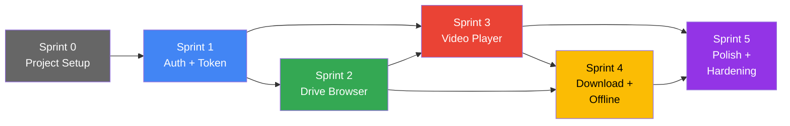

# DriveStream – Production Roadmap

> Roadmap xây dựng chi tiết với tiêu chuẩn production-grade. Mỗi Sprint có mục tiêu rõ ràng, acceptance criteria, quality gates, và dependency map.

---

## Tổng Quan Hệ Thống Tài Liệu Đã Xây Dựng

| # | Tài liệu | Vị trí | Mục đích |
|---|---|---|---|
| 1 | **Coding Standards & Agent Rules** | [`.agents/rules/coding-standards.md`](file:///c:/Users/tumin/OneDrive/Documents/STREAMING/.agents/rules/coding-standards.md) | Quy tắc bắt buộc cho mọi coding agent: Kotlin conventions, Compose patterns, security rules, error handling, performance thresholds, Definition of Done |
| 2 | **Technical Requirements** | [`docs/TECHNICAL_REQUIREMENTS.md`](file:///c:/Users/tumin/OneDrive/Documents/STREAMING/docs/TECHNICAL_REQUIREMENTS.md) | Functional/Non-functional requirements, ADRs, API contracts, data models, buffer config, manifest permissions |
| 3 | **Testing Strategy** | [`docs/TESTING_STRATEGY.md`](file:///c:/Users/tumin/OneDrive/Documents/STREAMING/docs/TESTING_STRATEGY.md) | Test specifications cho từng module, coverage targets, fake implementations, test fixtures, quality gate checklist, static analysis pipeline |
| 4 | **Operational Guide** | [`docs/OPERATIONAL_GUIDE.md`](file:///c:/Users/tumin/OneDrive/Documents/STREAMING/docs/OPERATIONAL_GUIDE.md) | Build pipeline, ProGuard config, error taxonomy, retry/circuit breaker patterns, structured logging, crash handling, performance monitoring, housekeeping |
| 5 | **Implementation Plan** | [Artifact](file:///c:/Users/tumin/.gemini/antigravity-ide/brain/930b13ae-c5d2-48b1-bb3e-d2952afc2a21/implementation_plan.md) | Kiến trúc tổng quan, chi tiết từng Phase, cấu trúc thư mục |

---

## Dependency Map



---

## Sprint 0: Project Foundation ⚙️
**Thời gian:** ~1 giờ | **Dependency:** Không | **Risk:** Thấp

### Mục tiêu
Thiết lập project Android hoàn chỉnh, cấu hình Gradle, dependencies, theme, và DI framework. Sau Sprint này, project PHẢI build thành công và hiển thị được 1 màn hình trống.

### Deliverables

| # | Task | Acceptance Criteria |
|---|---|---|
| S0-01 | Tạo project Android (Kotlin + Compose) | `./gradlew assembleDebug` thành công |
| S0-02 | Cấu hình `build.gradle.kts` với tất cả dependencies | Tất cả dependencies resolve thành công |
| S0-03 | Setup Material 3 Dark theme | App hiển thị với dark theme |
| S0-04 | Setup Hilt DI (`AppModule`, `@HiltAndroidApp`) | Hilt initialization thành công, không crash |
| S0-05 | Setup Navigation Compose (NavGraph rỗng) | App navigate được giữa 2 empty screens |
| S0-06 | Setup Room Database (empty schema) | Database khởi tạo thành công |
| S0-07 | Setup Timber logging | Log xuất hiện trong Logcat |
| S0-08 | Setup StrictMode (debug only) | StrictMode enabled, violations logged |
| S0-09 | Cấu hình `AndroidManifest.xml` | Permissions, security flags đúng |
| S0-10 | Setup detekt config | `./gradlew detekt` chạy thành công |

### Quality Gate
```
✅ ./gradlew assembleDebug       → SUCCESS
✅ ./gradlew lintDebug           → 0 errors
✅ ./gradlew detekt              → 0 errors
✅ App launches on device/emulator → Dark themed empty screen
```

---

## Sprint 1: Authentication & Token Management 🔐
**Thời gian:** ~3 giờ | **Dependency:** Sprint 0 | **Risk:** Trung bình

### Mục tiêu
Hoàn thành toàn bộ luồng xác thực: Sign-In → Token storage → Silent refresh → Sign-Out. Sau Sprint này, user PHẢI đăng nhập được và token tự động refresh trước khi hết hạn.

### Deliverables

| # | Task | Acceptance Criteria | Tests |
|---|---|---|---|
| S1-01 | `GoogleAuthManager` – Sign-In flow | User bấm Sign In → Google dialog → token received | Unit: mock Google Sign-In response |
| S1-02 | `TokenManager` – Encrypted storage | Token lưu trong EncryptedSharedPreferences | Unit: verify encryption, read/write |
| S1-03 | `TokenManager` – Proactive refresh | Token refresh khi còn < 300s | Unit: mock clock, verify refresh trigger |
| S1-04 | `TokenManager` – Concurrent dedup | 5 concurrent refresh → chỉ 1 actual API call | Unit: concurrent coroutine test |
| S1-05 | `TokenInterceptor` – Auto-attach header | Mọi request có `Authorization: Bearer <token>` | Unit: verify header presence |
| S1-06 | `TokenInterceptor` – 401 retry | 401 response → refresh → retry → success | Unit: MockWebServer 401 → 200 |
| S1-07 | `LoginScreen` – UI | Logo + Sign-In button + Loading + Error states | UI: Compose test all states |
| S1-08 | Auth state persistence | Tắt app → mở lại → vẫn signed in | Manual: kill app, relaunch |
| S1-09 | Sign-Out flow | Sign out → clear tokens → navigate to Login | Unit: verify cleanup |

### Quality Gate
```
✅ All unit tests pass
✅ User can sign in with Google account
✅ Token survives app restart
✅ Token refresh works (verify via log)
✅ Sign out clears all sensitive data
✅ No tokens appear in Logcat
```

### Agent Instructions
```
PHẢI đọc trước khi code:
- .agents/rules/coding-standards.md → Section 4 (Google Drive API Rules)
- .agents/rules/coding-standards.md → Section 5 (Security Rules)
- docs/TECHNICAL_REQUIREMENTS.md → Section 2 FR-01
- docs/TESTING_STRATEGY.md → Section 3.1 (TokenManager Tests)
- docs/OPERATIONAL_GUIDE.md → Section 2.1 (Error Classification)
```

---

## Sprint 2: Drive File Browser 📁
**Thời gian:** ~4 giờ | **Dependency:** Sprint 1 | **Risk:** Thấp

### Mục tiêu
Duyệt thư mục Google Drive, hiển thị video files với metadata. Sau Sprint này, user PHẢI browse được toàn bộ Drive, thấy video thumbnails, và navigate folders.

### Deliverables

| # | Task | Acceptance Criteria | Tests |
|---|---|---|---|
| S2-01 | `DriveRepository.listFiles()` | Trả về danh sách files/folders, chỉ video + folder | Unit: mock API, verify filter |
| S2-02 | `DriveRepository` – Field selection | Request chỉ chứa fields cần thiết | Unit: verify query string |
| S2-03 | `DriveRepository` – Pagination | Load 50 files/page, pageToken forwarding | Unit: 2-page mock scenario |
| S2-04 | `DriveRepository` – Rate limit handling | 403 → exponential backoff → retry | Unit: MockWebServer 403 → 200 |
| S2-05 | `DriveRepository` – Cache layer | Cache 5 phút, serve from cache khi fresh | Unit: mock clock, verify cache hit/miss |
| S2-06 | `DriveRepository.searchVideos()` | Full-text search across Drive | Unit: verify query construction |
| S2-07 | `DriveRepository.findSubtitleForVideo()` | Returns `null` (placeholder) | Unit: verify returns null |
| S2-08 | Room: `FileCacheDao` | Insert, query, expire, delete | Instrumented: in-memory Room DB |
| S2-09 | `DriveViewModel` – State management | Loading/Success/Error states, folder navigation stack | Unit: Turbine Flow test |
| S2-10 | `BrowserScreen` – File list UI | LazyColumn with VideoItem + FolderItem | UI: Compose test |
| S2-11 | `BrowserScreen` – Pull-to-refresh | Swipe down → reload from API | UI: Compose test |
| S2-12 | `BrowserScreen` – Search bar | Type query → filter results | UI: Compose test |
| S2-13 | `BrowserScreen` – Empty/Error states | Empty folder message, error with retry button | UI: Compose test |
| S2-14 | Rate Limiter utility | Max 5 requests/second, queue overflow | Unit: concurrent request test |

### Quality Gate
```
✅ All unit + instrumented tests pass
✅ Browse root folder → see files and folders
✅ Navigate into subfolder → see contents → back button works
✅ Thumbnails load correctly
✅ Search finds videos by name
✅ Rate limit handled gracefully (test by rapid refresh)
✅ Offline: shows cached content when no network
```

### Agent Instructions
```
PHẢI đọc trước khi code:
- .agents/rules/coding-standards.md → Section 3.1 (MVVM + UDF pattern)
- .agents/rules/coding-standards.md → Section 3.2 (Compose Rules)
- docs/TECHNICAL_REQUIREMENTS.md → Section 5.1 (API Contracts)
- docs/TECHNICAL_REQUIREMENTS.md → Section 6 (Data Models)
- docs/TESTING_STRATEGY.md → Section 3.2 (DriveRepository Tests)
```

---

## Sprint 3: Video Player ⭐ (Core)
**Thời gian:** ~5 giờ | **Dependency:** Sprint 1 + Sprint 2 | **Risk:** Cao

> [!CAUTION]
> Đây là Sprint phức tạp nhất. `GDriveDataSource` phải xử lý đúng HTTP Range requests, token refresh mid-stream, và error recovery. Test kỹ trước khi chuyển Sprint.

### Mục tiêu
Stream video từ Google Drive ở độ phân giải gốc qua ExoPlayer custom DataSource. Sau Sprint này, user PHẢI xem được video 4K mượt mà, tua tự do, và xem phim dài > 60 phút không bị ngắt.

### Deliverables

| # | Task | Acceptance Criteria | Tests |
|---|---|---|---|
| S3-01 | `GDriveDataSource.open()` | Gửi GET ?alt=media + Bearer token + Range header | Unit: MockWebServer verify request |
| S3-02 | `GDriveDataSource.read()` | Đọc bytes chính xác từ response body | Unit: verify byte content |
| S3-03 | `GDriveDataSource.close()` | Giải phóng connection, không leak | Unit: verify resource cleanup |
| S3-04 | `GDriveDataSource` – 206 Partial Content | Parse Content-Range, track position chính xác | Unit: mock 206 response |
| S3-05 | `GDriveDataSource` – 401 retry | Token expired → refresh → retry → success | Unit: MockWebServer 401 → 200 |
| S3-06 | `GDriveDataSource` – Rate limit recovery | 403 → backoff → retry (max 3) | Unit: MockWebServer sequence |
| S3-07 | `GDriveDataSource` – Network error retry | IOException → retry 3 times with delay | Unit: mock IOException |
| S3-08 | `GDriveDataSourceFactory` | Tạo DataSource với injected TokenManager | Unit: verify injection |
| S3-09 | ExoPlayer buffer configuration | LoadControl with optimized params (30s/90s/5s) | Verify: no ANR during 4K |
| S3-10 | `PlayerViewModel` – State management | Playing/Paused/Buffering/Error states | Unit: Turbine |
| S3-11 | `PlayerViewModel` – Position save | Save position every 10s + on pause + on stop | Unit: verify save calls |
| S3-12 | `PlayerViewModel` – Resume position | Load saved position, seek on start | Unit: verify seek call |
| S3-13 | `PlayerViewModel` – Lifecycle | Pause on background, resume on foreground | Unit: lifecycle mock |
| S3-14 | Room: `WatchHistoryDao` | Insert, update position, query recent | Instrumented: in-memory DB |
| S3-15 | `PlayerScreen` – UI | PlayerView + controls overlay + gestures | UI: Compose test |
| S3-16 | `PlayerScreen` – Fullscreen | Auto landscape, hide system bars | Manual: verify on device |
| S3-17 | `PlayerScreen` – Buffering UI | Show spinner + buffer %, hide when ready | UI: verify state changes |
| S3-18 | `PlayerScreen` – Gesture controls | Swipe seek + volume/brightness | Manual: verify gestures |
| S3-19 | PiP (Picture-in-Picture) | Enter PiP on home button | Manual: verify PiP |

### Quality Gate
```
✅ All unit + instrumented tests pass
✅ Play MP4 1080p file (< 1GB) → smooth, seekable
✅ Play MKV 4K file (~ 3-5GB) → smooth, seekable
✅ Play MOV file → works correctly
✅ Seek to random position → buffer < 3 seconds
✅ Watch > 65 minutes continuously → no interruption (token refresh verified)
✅ Pause → kill app → reopen → resume from saved position
✅ Memory during 4K playback < 350MB
✅ No ANR during any operation
```

### Agent Instructions
```
PHẢI đọc trước khi code:
- .agents/rules/coding-standards.md → Section 2.3 (Coroutines)
- .agents/rules/coding-standards.md → Section 2.4 (Error Handling)
- .agents/rules/coding-standards.md → Section 8 (Performance Rules)
- docs/TECHNICAL_REQUIREMENTS.md → Section 4 ADR-01 (DataSource design rationale)
- docs/TECHNICAL_REQUIREMENTS.md → Section 7 (Buffer Configuration – EXACT values)
- docs/TECHNICAL_REQUIREMENTS.md → Section 5.2 (Error Response Matrix – EXACT handling)
- docs/TESTING_STRATEGY.md → Section 3.3 (GDriveDataSource Tests)
- docs/TESTING_STRATEGY.md → Section 3.4 (PlayerViewModel Tests)
- docs/OPERATIONAL_GUIDE.md → Section 2.2 (Retry Strategy pattern)
```

---

## Sprint 4: Download & Offline Viewing 📥
**Thời gian:** ~4 giờ | **Dependency:** Sprint 2 + Sprint 3 | **Risk:** Trung bình

### Mục tiêu
Tải video về bộ nhớ máy để xem offline. Sau Sprint này, user PHẢI tải được video, xem khi không có mạng, pause/resume download, và quản lý storage.

### Deliverables

| # | Task | Acceptance Criteria | Tests |
|---|---|---|---|
| S4-01 | `DownloadManager.startDownload()` | Tải file qua ?alt=media → app-specific storage | Unit: mock HTTP, verify file write |
| S4-02 | `DownloadManager` – Progress Flow | Emit 0→100% realtime | Unit: Turbine, verify emissions |
| S4-03 | `DownloadManager` – Pause/Resume | Pause saves bytesDownloaded, resume sends Range header | Unit: verify Range header value |
| S4-04 | `DownloadManager` – Token refresh | Refresh token nếu download > 60 phút | Unit: mock clock |
| S4-05 | `DownloadManager` – Network disconnect | Auto-pause, set status = PAUSED | Unit: mock IOException |
| S4-06 | `DownloadManager` – Cancel | Delete partial file + DB record | Unit: verify cleanup |
| S4-07 | `DownloadManager` – Storage check | Check free space before download | Unit: mock storage API |
| S4-08 | `DownloadService` – Foreground Service | Notification with progress bar + Pause/Cancel | Manual: verify notification |
| S4-09 | `DownloadService` – Background survival | Download continues after app exit | Manual: kill app, check notification |
| S4-10 | Room: `DownloadedVideoDao` | CRUD + status queries | Instrumented: in-memory DB |
| S4-11 | `DownloadsScreen` – UI | List downloads, progress, swipe-to-delete | UI: Compose test |
| S4-12 | `DownloadsScreen` – Storage display | Show total storage used | UI: verify display |
| S4-13 | Player integration – Local preference | If downloaded → play local file, not stream | Unit: verify source selection |
| S4-14 | `DownloadButton` component | In BrowserScreen, shows download option | UI: Compose test |
| S4-15 | Concurrent download limit | Max 1 download at a time | Unit: verify queue behavior |

### Quality Gate
```
✅ All unit + instrumented tests pass
✅ Download 1GB video → completes → notification shows "Complete"
✅ Pause download → resume → completes correctly (file integrity)
✅ Kill app during download → download continues via Service
✅ Play downloaded video offline (airplane mode)
✅ Delete downloaded video → storage reclaimed
✅ Storage usage display accurate
✅ Insufficient storage → shows clear error message
```

### Agent Instructions
```
PHẢI đọc trước khi code:
- .agents/rules/coding-standards.md → Section 5 (Security Rules – SEC-09)
- docs/TECHNICAL_REQUIREMENTS.md → Section 2 FR-04 (Download requirements)
- docs/TECHNICAL_REQUIREMENTS.md → Section 4 ADR-04 (Foreground Service rationale)
- docs/TESTING_STRATEGY.md → Section 3.5 (DownloadManager Tests)
- docs/OPERATIONAL_GUIDE.md → Section 2.1 (InsufficientStorage error)
```

---

## Sprint 5: Polish, Hardening & Home Screen ✨
**Thời gian:** ~4 giờ | **Dependency:** Sprint 3 + Sprint 4 | **Risk:** Thấp

### Mục tiêu
Hoàn thiện UX: Home Screen, crash handling, performance optimization, housekeeping. Sau Sprint này, app PHẢI sẵn sàng sử dụng hàng ngày ở production quality.

### Deliverables

| # | Task | Acceptance Criteria | Tests |
|---|---|---|---|
| S5-01 | `HomeScreen` – Continue Watching | Danh sách video đang xem dở, sorted by lastWatched | UI: Compose test |
| S5-02 | `HomeScreen` – Recently Viewed | 20 video gần nhất | UI: Compose test |
| S5-03 | `HomeScreen` – Downloaded Videos | Quick access to offline content | UI: Compose test |
| S5-04 | `HomeScreen` – Browse Drive button | Navigate to BrowserScreen | UI: Compose test |
| S5-05 | Global error handler | `CrashHandler` saves crash log + playback position | Unit: mock crash scenario |
| S5-06 | Graceful degradation | Offline → show cached + downloaded content only | Manual: airplane mode |
| S5-07 | `HousekeepingManager` | Daily cleanup: expired cache, old metrics, orphaned downloads | Unit: verify cleanup logic |
| S5-08 | Circuit Breaker | 5 consecutive API failures → circuit opens → auto-reset after 60s | Unit: simulate failures |
| S5-09 | Network tracker | Log daily API calls and bandwidth | Unit: verify counting |
| S5-10 | Performance tracker | Log critical path timings, warn if slow | Unit: verify thresholds |
| S5-11 | Navigation polish | All screens connected, back stack correct | Manual: full flow test |
| S5-12 | ProGuard/R8 rules | Release build doesn't crash, API models preserved | Manual: release build test |
| S5-13 | Release build | Signed APK, minified, all features working | Manual: install on device |
| S5-14 | Full integration test | End-to-end: Login → Browse → Play → Download → Offline play → Resume | Manual: full flow |

### Quality Gate (Final)
```
✅ All unit + instrumented + UI tests pass
✅ ./gradlew assembleRelease → SUCCESS
✅ APK size < 25MB
✅ Cold start < 2 seconds
✅ Full E2E flow works on release build
✅ Crash handler captures and saves crash logs
✅ Housekeeping runs without errors
✅ Network tracker logs correctly
✅ 0 lint errors, 0 detekt errors
✅ Coverage ≥ 80%
```

---

## Summary: Tổng Quan Toàn Bộ

```mermaid
gantt
    title DriveStream Build Roadmap
    dateFormat HH:mm
    axisFormat %H:%M

    section Sprint 0
    Project Setup           :s0, 00:00, 1h

    section Sprint 1
    Auth + Token            :s1, after s0, 3h

    section Sprint 2
    Drive Browser           :s2, after s1, 4h

    section Sprint 3
    Video Player            :s3, after s2, 5h

    section Sprint 4
    Download + Offline      :s4, after s3, 4h

    section Sprint 5
    Polish + Hardening      :s5, after s4, 4h
```



| Metric | Target |
|---|---|
| **Tổng thời gian coding** | ~21 giờ |
| **Số lượng files** | ~35 production files + ~25 test files |
| **Test coverage** | ≥ 80% |
| **Quality gates** | 6 (1 per Sprint) |
| **Tài liệu quy tắc** | 4 documents (~2500 dòng) |
